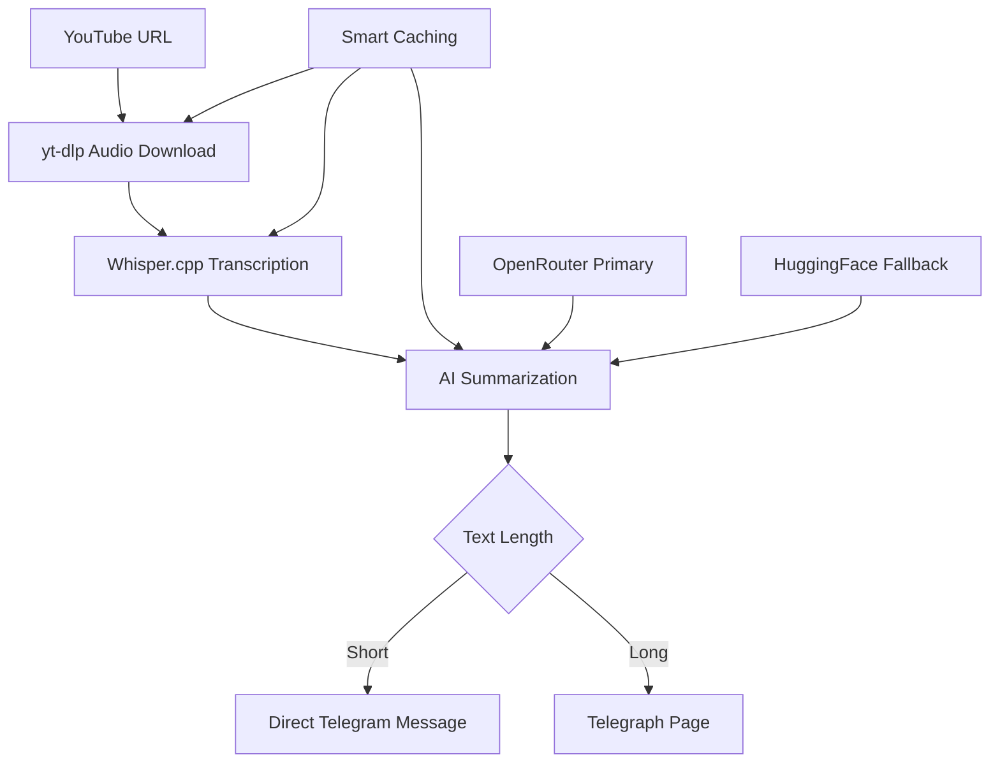

# 🎥 YouTube Telegram Summarizer Bot

A powerful Telegram bot that downloads YouTube videos, transcribes them using Whisper.cpp, and provides AI-generated summaries with smart caching and robust error handling.


## ✨ Features

- 🎥 **YouTube Audio Extraction** - Downloads audio from any YouTube video using yt-dlp
- 🎤 **Speech Transcription** - High-quality transcription using Whisper.cpp (offline)
- 🤖 **AI Summarization** - Dual AI service approach:
  - **Primary**: OpenRouter.ai (DeepSeek R1) - High quality, longer context
  - **Fallback**: Hugging Face (RuT5) - Reliable backup option
- 📄 **Telegraph Integration** - Long transcriptions published to telegra.ph automatically
- 🗄️ **Smart Caching System** - Chunk-level caching prevents token waste and speeds up re-processing
- 🛡️ **Robust Error Handling** - Graceful Telegram markdown parsing with fallbacks
- 🧹 **Intelligent Cleanup** - Automatic file management with manual cleanup options
- 📊 **Usage Statistics** - Built-in cache status and service monitoring commands

## 🚀 Quick Start

### Prerequisites

- Python 3.8+
- **Whisper.cpp** (set up in your workspace)
- **yt-dlp** (available in your workspace)
- **Telegram Bot Token** from [@BotFather](https://t.me/BotFather)
- **API Keys** (optional but recommended):
  - [OpenRouter.ai](https://openrouter.ai) - Free tier available
  - [Hugging Face](https://huggingface.co) - Free tier available

### Installation

1. **Clone the repository:**
   ```bash
   git clone https://github.com/yourusername/youtube-telegram-bot.git
   cd youtube-telegram-bot
   ```

2. **Install dependencies:**
   ```bash
   pip install -r requirements.txt
   ```

3. **Configure environment:**
   ```bash
   cp .env.example .env
   # Edit .env with your tokens
   ```

4. **Generate Telegraph token:**
   ```bash
   python create_telegraph_token.py
   ```

5. **Start the bot:**
   ```bash
   python bot.py
   ```

## 🎮 Bot Commands

| Command | Description |
|---------|-------------|
| `/start` or `/help` | Show welcome message and available commands |
| `/services` | Check AI service status and configuration |
| `/status` | Display cache status and disk usage |
| `/cleanup` | Clean up cached files to free space |
| `/chunks <url\|video_id>` | Retrieve cached chunk summaries for a video |

## 🔧 Configuration

### Environment Variables

Create a `.env` file with the following variables:

```bash
# Required
BOT_TOKEN=your_telegram_bot_token_here

# AI Services (at least one recommended)
OPENROUTER_API_KEY=your_openrouter_api_key_here  # Primary service
HF_TOKEN=your_huggingface_token_here              # Fallback service

# Telegraph (for long transcriptions)
TELEGRAPH_TOKEN=your_telegraph_token_here

# Paths (defaults work if whisper.cpp and yt-dlp are in workspace)
WHISPER_CLI_PATH=./whisper.cpp/build/bin/whisper-cli
WHISPER_MODEL_PATH=./whisper.cpp/models/ggml-small.bin
YT_DLP_PATH=./yt-dlp

# Directories
DOWNLOADS_DIR=./downloads
TRANSCRIPTIONS_DIR=./transcriptions
```

### Getting API Keys

1. **Telegram Bot Token**: 
   - Message [@BotFather](https://t.me/BotFather) on Telegram
   - Create new bot with `/newbot`
   - Copy the token

2. **OpenRouter API Key** (Recommended):
   - Visit [openrouter.ai](https://openrouter.ai)
   - Sign up for free account
   - Generate API key

3. **Hugging Face Token** (Fallback):
   - Visit [huggingface.co](https://huggingface.co)
   - Create account and go to Settings > Access Tokens
   - Create new token with read permissions

4. **Telegraph Token** (Auto-generated):
   - Run `python create_telegraph_token.py`
   - Token will be automatically added to your `.env` file

## 🔄 How It Works



### Processing Pipeline

1. **📥 Download**: Extracts audio from YouTube using yt-dlp (cached if exists)
2. **🎤 Transcribe**: Converts audio to text using Whisper.cpp (cached if exists)  
3. **🤖 Summarize**: Generates summary using AI services with chunk-level caching:
   - **Primary**: OpenRouter.ai with DeepSeek R1 (better quality, 4x longer context)
   - **Fallback**: Hugging Face with RuT5 model (reliable, works offline)
4. **📤 Deliver**: Sends via Telegram with markdown parsing fallbacks
5. **📄 Long Content**: Automatically creates Telegraph pages for long transcriptions
6. **🗄️ Cache**: Intelligent caching at every step to save time and API tokens

## 📁 Project Structure

```
youtube-telegram-bot/
├── 🤖 Core Bot Files
│   ├── bot.py                      # Main bot application with Telegram handlers
│   ├── config.py                   # Configuration and environment management
│   └── requirements.txt            # Python dependencies
│
├── 🔧 Service Modules  
│   ├── youtube_downloader.py       # yt-dlp integration with caching
│   ├── transcription_service.py    # Whisper.cpp integration with caching  
│   ├── summarization_service.py    # HuggingFace summarization service
│   ├── openrouter_summarization_service.py  # OpenRouter AI service
│   └── telegraph_service.py        # Telegraph page creation service
│
├── 🧪 Test Suite (Beautiful!)
│   ├── test_improved_caching.py    # Caching and error handling tests
│   ├── test_openrouter.py          # OpenRouter API integration tests
│   ├── test_telegraph_fix.py       # Telegraph service tests  
│   ├── test_inference.py           # AI inference tests
│   ├── test_long_transcription.py  # Long content handling tests
│   └── test_setup.py               # Environment setup tests
│
├── 📋 Setup & Configuration
│   ├── .env.example                # Environment template
│   ├── create_telegraph_token.py   # Telegraph token generator
│   └── .gitignore                  # Git ignore rules
│
├── 📁 Runtime Directories
│   ├── downloads/                  # Temporary audio files (gitignored)
│   ├── transcriptions/             # Temporary text files (gitignored)
│   ├── cache/                      # Chunk summaries and caching (gitignored)
│   └── whisper.cpp/                # Whisper.cpp installation
│
└── 📚 Documentation
    ├── README.md                   # This comprehensive guide
    ├── IMPROVEMENTS.md             # Development history and improvements
    └── TOOLS.md                    # Development tools and commands
```

## 🛠️ Advanced Features

### Smart Caching System
- **Multi-level caching**: Audio files, transcriptions, and chunk summaries
- **Token efficiency**: Chunk-level caching prevents re-processing and saves API costs
- **Cache management**: `/status` and `/cleanup` commands for monitoring and maintenance

### Error Handling & Reliability
- **Telegram Markdown Fallbacks**: Automatically handles parsing errors with progressive fallbacks
- **Service Redundancy**: Primary/fallback AI service configuration
- **Robust File Handling**: Graceful handling of corrupted downloads and transcription failures

### Telegraph Integration
- **Automatic Publishing**: Long transcriptions (>3500 chars) automatically published to telegra.ph
- **Fallback Chunking**: If Telegraph fails, content is split into multiple Telegram messages
- **Video Attribution**: Telegraph pages include original YouTube video links

### Chunk Retrieval System
- **Individual Access**: Use `/chunks <video_id>` to retrieve cached chunk summaries
- **Debugging Support**: Helpful for understanding how long videos were processed
- **Token Transparency**: Shows exactly what was sent to AI services

## 🔍 Testing Suite

The project includes a comprehensive test suite (**they are beautiful!**):

```bash
# Test improved caching and error handling
python test_improved_caching.py

# Test OpenRouter API integration  
python test_openrouter.py

# Test Telegraph service functionality
python test_telegraph_fix.py

# Test AI inference capabilities
python test_inference.py

# Test long transcription handling
python test_long_transcription.py

# Test environment setup
python test_setup.py
```

## 🐛 Troubleshooting

### Common Issues

1. **Bot doesn't respond**:
   - Check `BOT_TOKEN` in `.env` file
   - Verify bot is running with `python bot.py`
   - Check firewall/network connectivity

2. **Audio download fails**:
   - Ensure `yt-dlp` is executable and up to date
   - Check `YT_DLP_PATH` in `.env`
   - Verify YouTube URL is valid and accessible

3. **Transcription fails**:
   - Verify Whisper.cpp is built: `./whisper.cpp/build/bin/whisper-cli`
   - Check Whisper model exists: `./whisper.cpp/models/ggml-small.bin`
   - Ensure sufficient disk space for audio files

4. **AI summarization issues**:
   - Check API keys are valid and have quota
   - Monitor service status with `/services` command
   - Review logs for specific error messages

5. **Telegraph errors**:
   - Regenerate token: `python create_telegraph_token.py`
   - Check content isn't too large (>64KB limit)
   - Verify network connectivity to telegra.ph

### Debug Commands

```bash
# Check service status
/services

# View cache status and disk usage  
/status

# Test specific video processing
# (send YouTube URL to bot)

# Retrieve processing details
/chunks <video_id>
```

## 🤝 Contributing

Contributions are welcome! Please feel free to submit a Pull Request. The test suite is comprehensive and should help ensure your changes work correctly.

## 📄 License

This project is licensed under the MIT License - see the [LICENSE](LICENSE) file for details.

## 🙏 Acknowledgments

- [Whisper.cpp](https://github.com/ggml-org/whisper.cpp) - High-performance speech recognition
- [yt-dlp](https://github.com/yt-dlp/yt-dlp) - YouTube video/audio extraction  
- [OpenRouter.ai](https://openrouter.ai) - AI model API gateway
- [Hugging Face](https://huggingface.co) - Machine learning model hub
- [Telegraph](https://telegra.ph) - Anonymous publishing platform

---

**Made with ❤️ for the YouTube summarization community**
